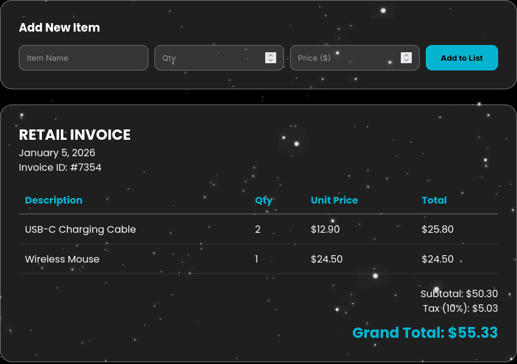
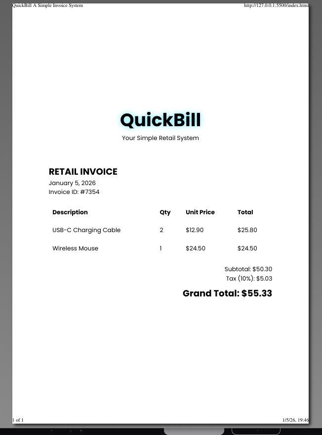

# QuickBill – Simple Invoice System

QuickBill is a beginner-friendly invoice system designed to simulate a real retail billing workflow.  
It allows users to add products, calculate totals, and generate a clean, formatted invoice ready for printing.

## Features
- Add item name, quantity, and unit price
- Automatic calculation of subtotal, tax, and grand total
- Dynamic invoice table with real-time updates
- Automatic invoice ID and current date generation
- Print-friendly invoice layout (PDF-ready)
- Reset invoice functionality

## Technologies Used
- HTML5
- CSS3 (Glassmorphism UI)
- Vanilla JavaScript

## How It Works
1. The user enters an item name, quantity, and unit price.
2. Items are stored in an array and rendered dynamically in a table.
3. The system calculates the subtotal, tax (10%), and grand total automatically.
4. An invoice ID and the current date are generated when the first item is added.
5. The invoice can be printed or reset at any time.

## Custom Feature
**Automatic Invoice ID and Date**  
Each invoice generates a random unique ID and displays the current date, simulating a real retail invoice system.

## Screenshots

## BitBuilders Fun Code Race – January 2026
This project was developed for the BitBuilders Fun Code Race on Devpost.  
It was built as a solo project and fully implemented and tested by the author.
